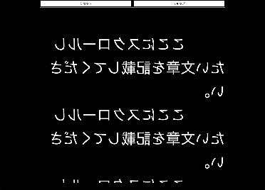

# プロンプターテキストビューワー

## 概要
このアプリケーションは、プロンプター用のテキスト表示システムです。テキストを自動スクロールさせながら表示することができ、プレゼンテーションやスピーチの補助ツールとして活用できます。

## 主な機能
- テキストの自動スクロール表示
- ミラー表示（テキストが反転表示）
- スクロールの一時停止/再開
- スクロール位置のリセット
- ページ送り機能

## 使用方法
1. HTMLファイルをブラウザで開くだけで使用可能です
2. 表示したいテキストを`.scroll-content`内に記載します
3. 画面をクリックすることでスクロールの一時停止/再開ができます
4. 「リセット」ボタンでテキストを先頭に戻せます
5. 「スキップ」ボタンで次のセクションに素早く移動できます

## カスタマイズ可能な設定
- フォントサイズ: `.scroll-content`の`font-size`を変更
- スクロール速度: JavaScriptの`pos -= 1`の値を調整
- 表示幅: `.container`の`max-width`を調整
- 文字色: `.scroll-content`の`color`を変更

## 技術仕様
- 純粋なHTML/CSS/JavaScriptで実装
- requestAnimationFrameを使用した滑らかなスクロールアニメーション
- レスポンシブデザイン対応
- モダンブラウザ対応

## 注意事項
- ブラウザのJavaScriptを有効にする必要があります
- 大量のテキストを入力する場合はブラウザの性能に依存します